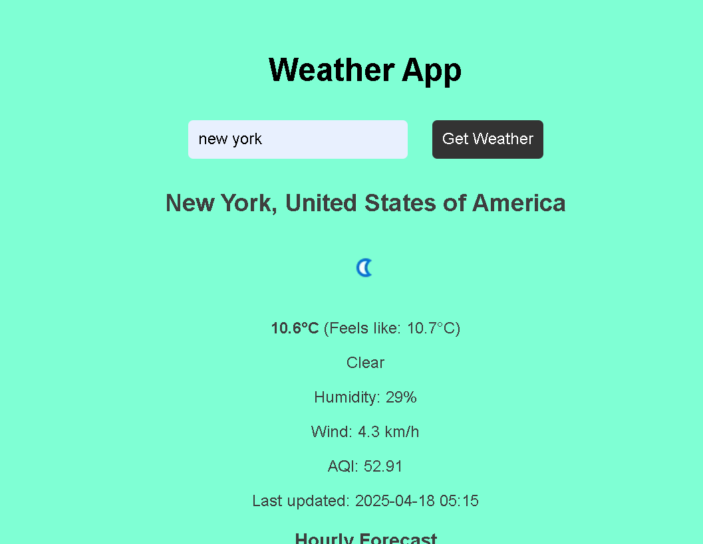
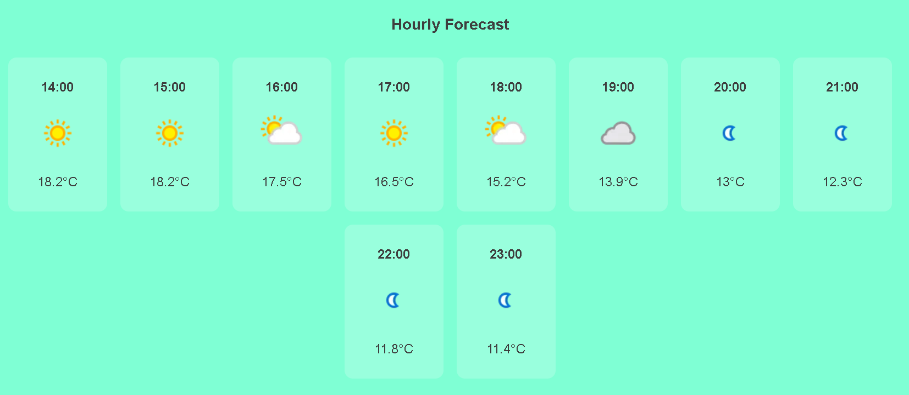

# 🌤️ Weather App

A responsive weather web application built using **HTML**, **CSS**, and **JavaScript**. It fetches real-time weather data using the [WeatherAPI](https://www.weatherapi.com/), and displays the current conditions along with an hourly forecast.

> **Note:** This app works from local files but may not work when directly hosted from GitHub due to API key and CORS restrictions.

---

## 🚀 Features

- 🔍 Search weather by city or location
- 🌡️ Current temperature and "feels like"
- 🌥️ Weather condition icons
- 💨 Wind speed, 🌫️ Humidity, and AQI (Air Quality Index)
- 🕐 Hourly forecast for the rest of the day
- 🎨 Animated background that changes with weather type

---

## 📁 Project Structure

- `index.html` – Main HTML structure
- `style.css` – Weather-based styling & layout
- `script.js` – Fetches and displays weather using WeatherAPI

---

## 🔧 Technologies Used

- HTML5
- CSS3
- JavaScript (ES6+)
- [WeatherAPI](https://www.weatherapi.com/)

---

## 📸 Screenshot

---

## ✅ How to Run

1. Clone or download this repo.
2. Open `index.html` in your browser.
3. Enter a location and click "Get Weather".

---

## ❗ Known Limitations

- Requires a valid internet connection to fetch data.
- May not run when hosted directly on GitHub due to **CORS restrictions** and **local API key usage**.

---

## 💡 Future Improvements

- Add dark mode toggle
- Add geolocation support
- Improve error handling
- Host with backend proxy to solve CORS

---

## 📬 Contact

Feel free to connect with me on [LinkedIn](https://www.linkedin.com/in/kundan-tarafdar-9b53151b7/) or check out more on my [GitHub profile](https://github.com/kundanTarafdar04).
